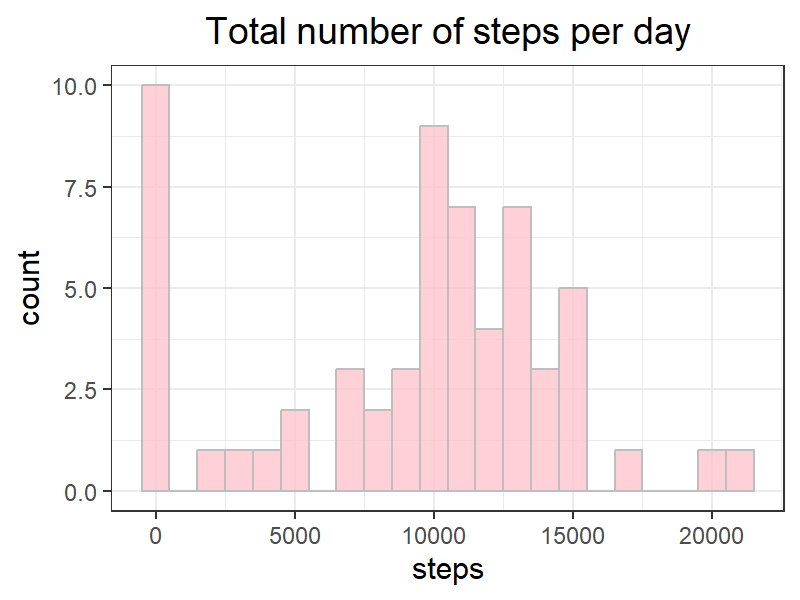
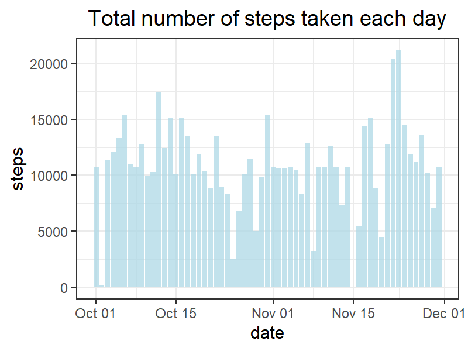

## Global Settings


```r
knitr::opts_chunk$set(echo = TRUE, warning = FALSE, 
                      dpi = 200,  fig.width = 4, fig.height =3,
                      fig.align = "center", fig.keep = "all" ,
                      fig.path = "figures/", dev = "png")
```


## Loading and preprocessing the data


first of all, load in the packages we need, unzip the file, then make the class of var correct.

take a look of the summary of the data.

there is 3 var, steps, date and interval, note that steps have NAs in it.


```r
library("dplyr")
```

```
## 
## Attaching package: 'dplyr'
```

```
## The following objects are masked from 'package:stats':
## 
##     filter, lag
```

```
## The following objects are masked from 'package:base':
## 
##     intersect, setdiff, setequal, union
```

```r
library("ggplot2")

data <- read.csv(unzip("activity.zip"))

data$date <- as.POSIXct(data$date)
dates <- levels(as.factor(data$date)) # Oct 1 to Nov 31
data <- tibble::as_tibble(data)
summary(data)
```

```
##      steps             date               interval     
##  Min.   :  0.00   Min.   :2012-10-01   Min.   :   0.0  
##  1st Qu.:  0.00   1st Qu.:2012-10-16   1st Qu.: 588.8  
##  Median :  0.00   Median :2012-10-31   Median :1177.5  
##  Mean   : 37.38   Mean   :2012-10-31   Mean   :1177.5  
##  3rd Qu.: 12.00   3rd Qu.:2012-11-15   3rd Qu.:1766.2  
##  Max.   :806.00   Max.   :2012-11-30   Max.   :2355.0  
##  NA's   :2304
```

## What is the mean total number of steps taken per day?

split the data by date, then calculate the steps by mean and median per day.

we'll got a data with dates, mean and median.

actually, rather than for loop, dplyr's aggregate will be more simple.


1. For this part of the assignment, you can ignore the missing values in the dataset.

Make a histogram of the total number of steps taken each day.


```r
a <- split(data, data$date)


dates_steps <- data.frame()

for(i in 1:length(dates)){
        stepsum <- sum(a[[i]][1])
        dates_steps <- rbind(dates_steps, stepsum)
}

names(dates_steps)[1] <- "steps"
dates_steps <- cbind(dates, dates_steps)
dates_steps$dates <- as.POSIXct(dates_steps$dates)

dates_steps$steps[is.na(dates_steps$steps)] <- 0

ggplot(data = dates_steps, aes(steps)) + 
        labs(title = "Total number of steps per day") +
        geom_histogram(fill = "pink",color = "grey", alpha = 3/4, binwidth = 1000) +
        theme_bw() + theme(plot.title = element_text(hjust = 0.5))
```



2. Calculate and report the mean and median total number of steps taken per day

this is how the data looks like so far.

we'll gonna sum up the steps then calculate the mean and median.


```r
head(dates_steps)
```

```
##        dates steps
## 1 2012-10-01     0
## 2 2012-10-02   126
## 3 2012-10-03 11352
## 4 2012-10-04 12116
## 5 2012-10-05 13294
## 6 2012-10-06 15420
```


```r
mean <- mean(dates_steps$steps)
median <- median(dates_steps$steps)

c(mean = mean, median = median)
```

```
##     mean   median 
##  9354.23 10395.00
```


## What is the average daily activity pattern?

split the data by interval, calculate the avg steps of each interval, then put it all together.

make a plot of it.

1. Make a time series plot (i.e. type = "l") of the 5-minute interval (x-axis) and the average number of steps taken, averaged across all days (y-axis)


```r
byinterval <- split(data, data$interval)
intervals <- levels(as.factor(data$interval))

mean_per_interval <- data.frame()

for(i in 1:length(byinterval)){
        means <- mean(byinterval[[i]]$steps, na.rm = T)
        mean_per_interval <- rbind(mean_per_interval, means)
}

names(mean_per_interval) <- "mean_per_interval"
interval_mean <- cbind(intervals, mean_per_interval)

interval_mean$intervals <- as.numeric(interval_mean$intervals)

ggplot(data = interval_mean, aes(intervals, mean_per_interval)) + 
        geom_line(color = "pink", linewidth = 1.2) + theme_bw() +
        labs(title = "Average number of steps by time of day") + 
        theme(plot.title = element_text(hjust = 0.5)) + 
        xlab("intervals of a day") + ylab("average of steps")
```


2. Which 5-minute interval, on average across all the days in the dataset, contains the maximum number of steps?

```r
interval_mean[which.max(interval_mean$mean_per_interval),]
```

```
##     intervals mean_per_interval
## 104       835          206.1698
```


## Imputing missing values

1. Calculate and report the total number of missing values in the dataset (i.e. the total number of rows with NAs.


```r
sum(is.na(data$steps))
```

```
## [1] 2304
```

2. Devise a strategy for filling in all of the missing values in the dataset. The strategy does not need to be sophisticated. For example, you could use the mean/median for that day, or the mean for that 5-minute interval, etc.

I decided to input the NAs as the average steps of each interval.

```r
step_fill <- interval_mean$mean_per_interval[match(data$interval, intervals)]
```

3. Create a new dataset that is equal to the original dataset but with the missing data filled in.


```r
input_step <- data %>% transform(steps = ifelse(is.na(steps), step_fill, steps))
# replace_na() na_if()
#data %>% mutate(steps = replace_na(steps, step_fill))

head(input_step)
```

```
##       steps       date interval
## 1 1.7169811 2012-10-01        0
## 2 0.3396226 2012-10-01        5
## 3 0.1320755 2012-10-01       10
## 4 0.1509434 2012-10-01       15
## 5 0.0754717 2012-10-01       20
## 6 2.0943396 2012-10-01       25
```

```r
sum(is.na(input_step$steps))
```

```
## [1] 0
```

4. Make a histogram of the total number of steps taken each day and Calculate and report the mean and median total number of steps taken per day.


```r
dates_steps_2 <- aggregate(steps ~ date, input_step, sum)

ggplot(data = dates_steps_2, aes(date, steps)) + 
        labs(title = "Total number of steps taken each day") +
        geom_col(fill = "lightblue", alpha = 3/4) + theme_bw() +
        theme(plot.title = element_text(hjust = 0.5))
```



Do these values differ from the estimates from the first part of the assignment? What is the impact of imputing missing data on the estimates of the total daily number of steps?

after replacing the NA values, the mean and median has changed.
Imputing NA with mean value will change the distribution of the data.


```r
mean <- mean(dates_steps_2$steps)
median <- median(dates_steps_2$steps)

c(mean = mean, median = median)
```

```
##     mean   median 
## 10766.19 10766.19
```
by using the average steps of interval replacing NAs, it will not change the mean of each interval.


```r
input_step$interval <- as.factor(input_step$interval)
mean_per_interval2 <- aggregate(input_step$steps,list(input_step$interval), mean)

sum(ifelse(mean_per_interval$mean_per_interval == mean_per_interval2$x , F, T))
```

```
## [1] 0
```

```r
# the mean steps of interval is exactly the same before and after the replacing.
```


## Are there differences in activity patterns between weekdays and weekends?

1. Create a new factor variable in the dataset with two levels – “weekday” and “weekend” indicating whether a given date is a weekday or weekend day.


```r
input_step2 <- input_step %>% mutate(weekdays = weekdays(date))

input_step2$weekdays <- ifelse(input_step2$weekdays != c("Saturday", "Sunday"),"Weekday" ,"Weekend")
input_step2$weekdays <- as.factor(input_step2$weekdays)
```

2. Make a panel plot containing a time series plot (i.e. type = "l") of the 5-minute interval (x-axis) and the average number of steps taken, averaged across all weekday days or weekend days (y-axis). The plot should look something like the following, which was created using simulated data:


```r
input_step3 <- input_step2 %>% aggregate(steps ~ interval + weekdays, mean, na.rm = T)

input_step3$interval <- as.numeric(input_step3$interval)
# if interval is a factoe, aes(group = 1), or then make x and y both numeric like here did

g <- ggplot(input_step3, aes(interval, steps, color = weekdays))

g + geom_line(alpha = 3/4, lwd = 0.7) +  
        scale_color_manual(values = c("pink", "lightblue"))+
        facet_grid(weekdays~.) +
        theme_bw() + xlab("Interval") + ylab("Steps") +  
        labs(title = "Average Steps by Day Type") + 
        theme(plot.title = element_text(hjust = 0.5)) 
```


